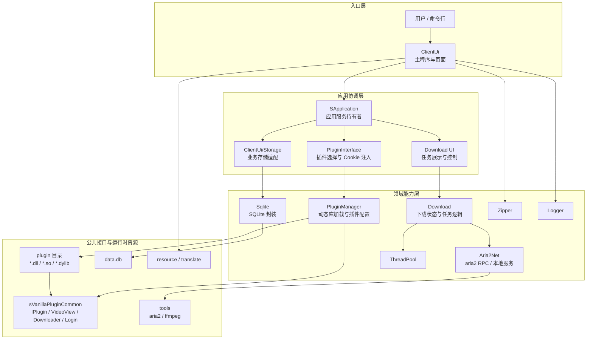
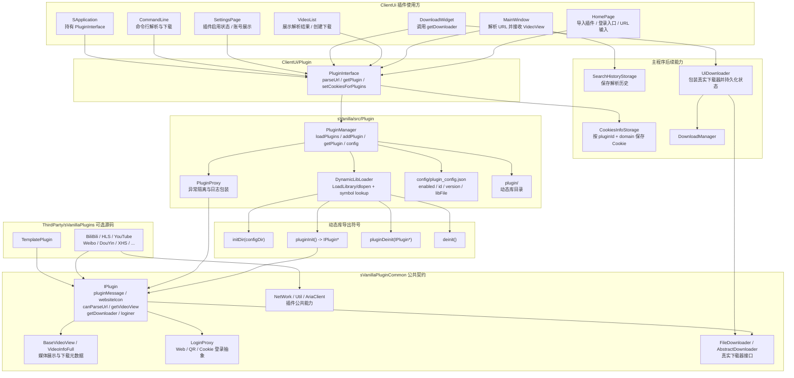
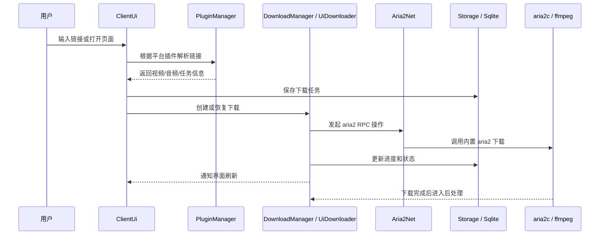
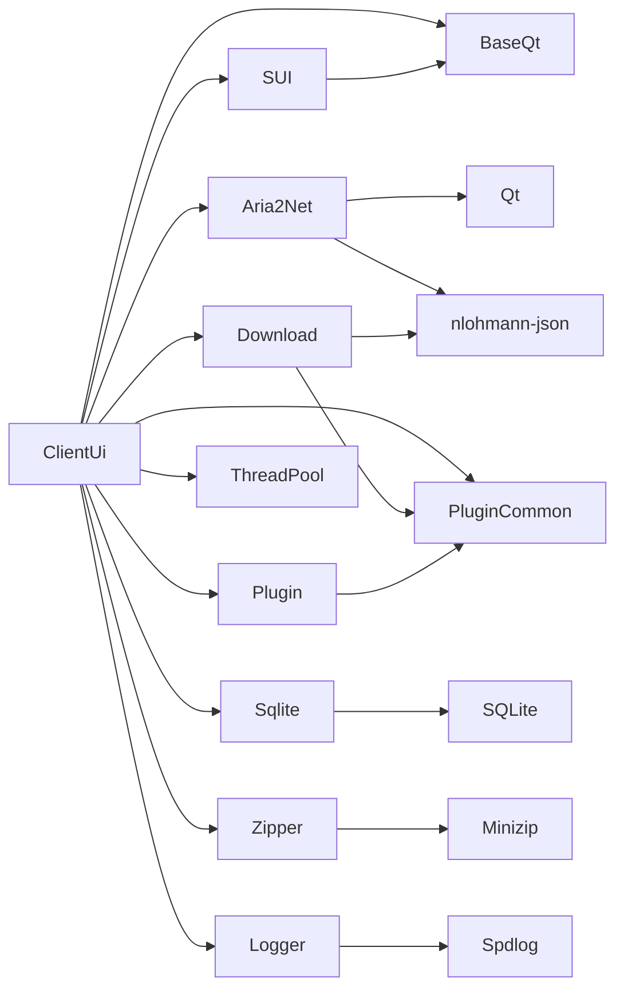
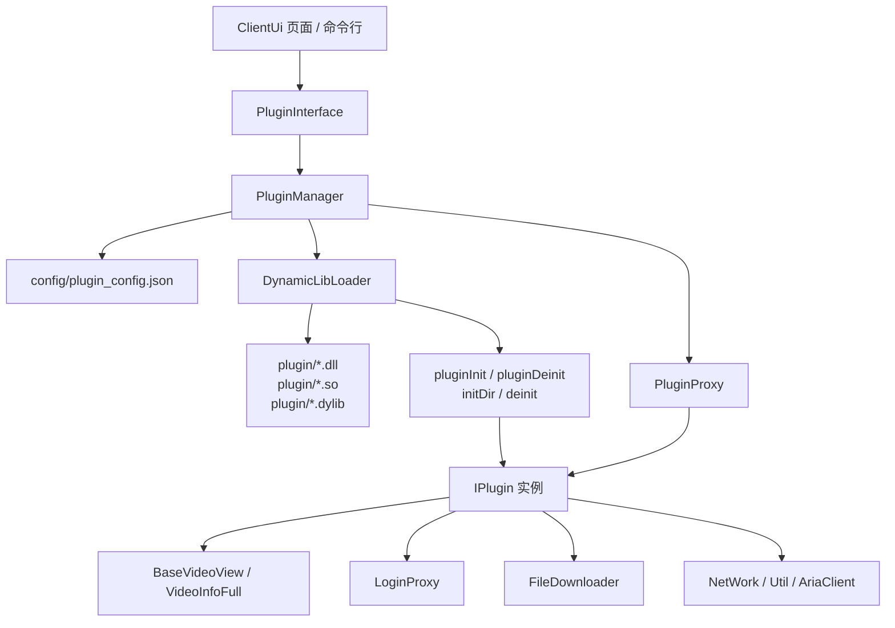
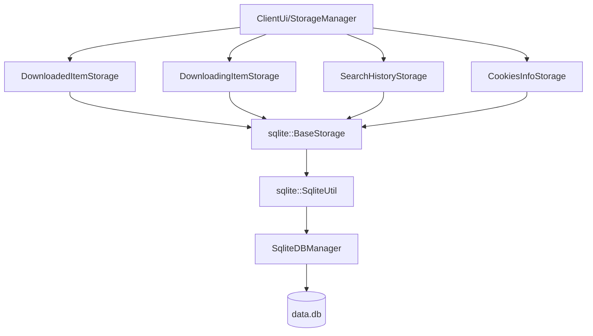
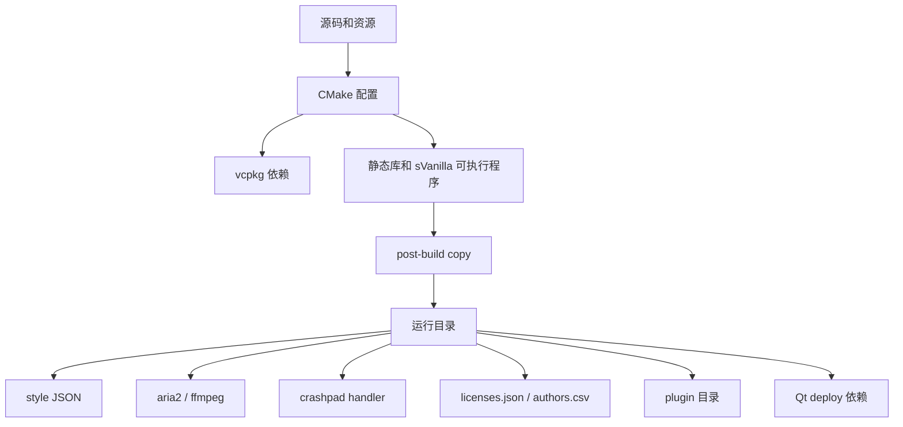

# sVanilla 项目架构

本文档用于说明 sVanilla 的工程结构、模块边界、运行流程和构建组织。阅读顺序建议先看精简架构图，再看细化架构图和模块说明。

## 一、项目定位

sVanilla 是一个跨平台 C++20 桌面下载器，面向 Windows、Linux 和 macOS。主程序基于 Qt Widgets/WebEngine 构建，下载能力由内置 aria2、插件系统和下载管理模块协同完成。

核心技术栈：

- UI: Qt Widgets、Qt WebEngine、QWindowKit、VanillaStyle
- 构建: CMake、vcpkg、Python 脚本
- 数据: SQLite、项目内 `Sqlite` 封装
- 下载: aria2、curl、OpenSSL、ffmpeg
- 插件: `sVanillaPluginCommon`、可选 `sVanillaPlugins`
- 基础库: spdlog、nlohmann-json、minizip、crashpad、GoogleTest

## 二、精简架构图



从使用者角度看，`ClientUi` 是唯一可执行入口。它通过 `SApplication` 持有应用级服务，并把 UI 操作转交给插件、下载、存储、线程池和运行时工具。插件接口位于公共库 `sVanillaPluginCommon`，真实插件以动态库形式放在运行目录的 `plugin/` 下。

## 三、插件细化架构图



插件部分的核心边界是 `IPlugin`。主程序只依赖公共契约，不直接依赖具体站点插件；具体插件通过动态库导出符号交给 `DynamicLibLoader` 创建，再由 `PluginProxy` 包装后放入 `PluginManager` 的插件表。这样主程序可以在插件异常时记录日志并返回空结果，避免单个插件直接拖垮 UI 流程。

## 四、运行时主流程



该流程里的 UI、插件、下载和存储是主业务闭环。`ffmpeg` 主要作为运行时工具用于媒体处理，`aria2c` 负责实际下载。

## 五、顶层目录

| 路径 | 职责 |
| --- | --- |
| `AGENTS.md` | AI 智能体协作总规则和 Harness 工作入口 |
| `CMakeLists.txt` | 顶层构建入口，设置 vcpkg toolchain、C++20、全局选项和子目录 |
| `vcpkg.json` | vcpkg 依赖清单和版本约束 |
| `vcpkg-configuration.json` | vcpkg baseline、overlay ports、overlay triplets |
| `.codex/` | Codex 专用命令、提示词和适配说明，不保存共享规范副本 |
| `.github/workflows` | CI、格式检查、静态分析、跨平台构建和发布流程 |
| `cmake/` | 图标、版本、Qt deploy、WiX、打包和辅助 CMake 脚本 |
| `scripts/` | 资源生成、安装清单、作者/许可证生成、打包脚本 |
| `tools/` | 平台内置工具，例如 aria2、ffmpeg |
| `doc/` | 用户文档和开发文档 |
| `harness/` | 工具无关的工程规范、SDD、需求档案、实现知识、模板和工作流 |
| `ThirdParty/` | Git 子模块和第三方源码，包括 vcpkg、spdlog、插件公共库和插件源码 |
| `sVanilla/` | 主程序源码、资源和翻译 |
| `test/` | GoogleTest 测试 |
| `example/` | 示例工程 |
| `overlay/` | vcpkg overlay ports、triplets、toolchains |

## 六、源码模块

| 模块 | 类型 | 职责 |
| --- | --- | --- |
| `sVanilla/src/ClientUi` | 可执行程序 | 主窗口、页面、设置、登录、下载 UI、业务存储适配、平台初始化、部署 |
| `sVanilla/src/SUI` | 静态库 | 可复用 Qt UI 组件，例如输入、提示、表格、WebEngine 包装组件 |
| `sVanilla/src/BaseQt` | 静态库 | Qt 基础工具、树结构、工具函数 |
| `sVanilla/src/Base` | 头文件工具 | 宏和基础定义 |
| `sVanilla/src/Aria2Net` | 静态库 | aria2 通信/RPC 封装 |
| `sVanilla/src/Download` | 静态库 | 下载状态、下载线程和下载基础逻辑 |
| `sVanilla/src/Plugin` | 静态库 | 动态库加载、插件管理、插件日志 |
| `sVanilla/src/Sqlite` | 静态库 | SQLite RAII 封装、SQL 组合、Storage 抽象 |
| `sVanilla/src/ThreadPool` | 静态库 | 任务和线程池 |
| `sVanilla/src/Zipper` | 静态库 | minizip 压缩/解压 |
| `sVanilla/src/Logger` | 静态库 | spdlog 日志封装 |

### 模块依赖简图



## 七、资源和国际化

| 路径 | 职责 |
| --- | --- |
| `sVanilla/resource/sVanilla.qrc` | Qt 资源入口 |
| `sVanilla/resource/icon` | 界面图标 |
| `sVanilla/resource/style` | 深浅色主题 JSON，构建后复制到输出目录 |
| `sVanilla/resource/appIcon` | 应用图标和品牌资源 |
| `sVanilla/translate` | Qt 翻译 `.ts` 文件 |

资源在 `ClientUi` 构建阶段通过 Qt 自动资源处理、翻译生成和 post-build copy 进入最终产物。

## 八、插件体系

插件体系分为主程序管理、公共接口和具体插件三层。主程序只通过 `IPlugin`、`BaseVideoView`、`VideoInfoFull`、`LoginProxy`、`FileDownloader` 等公共类型和插件交互，具体站点逻辑留在动态库插件中。

| 层级 | 路径 | 职责 |
| --- | --- | --- |
| 主程序插件门面 | `sVanilla/src/ClientUi/Plugin` | 为 UI、命令行、下载和登录流程提供 `parseUrl()`、`getPlugin()`、Cookie 注入等入口 |
| 主程序插件管理 | `sVanilla/src/Plugin` | 扫描 `plugin/` 目录、读取插件配置、加载动态库、包装插件实例、按 `pluginId` 查询插件 |
| 插件公共能力 | `ThirdParty/sVanillaPluginCommon` | 定义 `IPlugin`、媒体视图、登录代理、下载器接口、网络和 aria 客户端等公共能力 |
| 具体插件实现 | `ThirdParty/sVanillaPlugins` | 可选插件源码，例如 BiliBili、HLS、YouTube、Weibo 等站点或协议的解析实现 |



插件加载顺序：

1. `PluginManager` 创建 `plugin/` 目录并读取 `config/plugin_config.json`。
2. 按平台扩展名扫描动态库：Windows 使用 `.dll`，Linux 使用 `.so`，macOS 使用 `.dylib`。
3. `DynamicLibLoader` 加载动态库并查找 `initDir`、`pluginInit`、`pluginDeinit`、`deinit`。
4. `pluginInit()` 返回 `IPlugin*` 后，主程序用 `PluginProxy` 包装真实插件。
5. 插件配置中 `enabled` 为 true 且插件有效时，实例进入 `PluginManager` 的 `pluginId -> IPlugin` 映射。

插件运行接口：

| 接口 | 主程序使用场景 |
| --- | --- |
| `pluginMessage()` | 读取 `pluginId`、名称、版本、描述、domain，并生成插件配置和设置页展示 |
| `websiteIcon()` | 在输入框、列表或插件相关 UI 中展示站点图标 |
| `canParseUrl(url)` | `PluginInterface::parseUrl()` 选择可处理当前链接的插件 |
| `getVideoView(url)` | 解析链接并返回媒体列表给 `MainWindow` / `VideoList` |
| `getDownloader(videoInfo)` | 下载页创建真实下载器，再由 `UiDownloader` 包装并持久化状态 |
| `loginer()` | 登录、Cookie 注入、账号信息、历史记录读取等流程 |

启用 `ENABLE_BUILD_PLUGINS` 时，顶层 CMake 会先执行 `scripts/merge_plugins_vcpkg.py`，再构建 `ThirdParty/sVanillaPlugins`，最后把插件产物复制到输出目录的 `plugin/`。如果只构建主程序，插件源码不是必需输入，但运行时仍可从 `plugin/` 加载已有动态库。

## 九、数据存储

主业务存储通过 `ClientUi/Storage` 对接 `sVanilla/src/Sqlite`。默认业务数据库为 `data.db`。



更详细的 SQLite 设计见 `doc/develop/sqlite_architecture.md`。

## 十、构建和测试

顶层 CMake 关键选项：

| 选项 | 默认值 | 作用 |
| --- | --- | --- |
| `ENABLE_TEST` | `OFF` | 启用 `test/` |
| `ENABLE_CLANG_TIDY` | `OFF` | 启用 clang-tidy |
| `ENABLE_BUILD_PLUGINS` | `OFF` | 构建插件 |
| `ENABLE_BUILD_EXAMPLE` | `OFF` | 构建示例 |
| `ENABLE_DEPLOY` | `ON` | `ClientUi` 部署逻辑 |

现有测试目录：

- `test/SQLite`
- `test/ThreadPool`
- `test/Zipper`

推荐验证命令：

```bash
cmake -B build -S . -DCMAKE_BUILD_TYPE=Debug -DENABLE_TEST=ON
cmake --build build --config Debug --parallel
ctest --test-dir build --build-config Debug --output-on-failure
```

格式和静态分析：

```bash
python scripts/clang_format_all.py
cmake -B build -S . -DCMAKE_BUILD_TYPE=Release -DENABLE_CLANG_TIDY=ON
cmake --build build --config Release --parallel
```

## 十一、构建产物流向



`ClientUi` 的 CMake 脚本会负责复制样式、工具、crashpad、licenses、authors、spdlog、ffmpeg 和可选插件，并在 `ENABLE_DEPLOY` 开启时执行 Qt 部署。

## 十二、维护关注点

- `ClientUi` 聚合了 UI、存储、下载、插件和部署逻辑，分析问题时应先定位具体页面或业务流程。
- CMake 使用 `file(GLOB_RECURSE)` 收集源码，新增文件通常不需要手动加入源列表，但仍需要确认目标和 include 依赖。
- 构建依赖 Qt、vcpkg、Python 和平台工具，首次配置可能耗时较长。
- `ThirdParty` 多为子模块或第三方源码，除非需求明确，通常只在边界接口处适配。
- 插件构建是可选路径，未启用 `ENABLE_BUILD_PLUGINS` 时主程序仍可构建核心功能。
