# SQLite 存储设计

本文档说明 `sVanilla/src/Sqlite` 的设计架构、优点和使用方式。该模块不是完整 ORM，而是面向项目业务的轻量 SQLite 封装：底层管理连接和语句，中间层负责 SQL 生成，业务层以 `Storage` 形式暴露读写接口。

## 一、总体架构

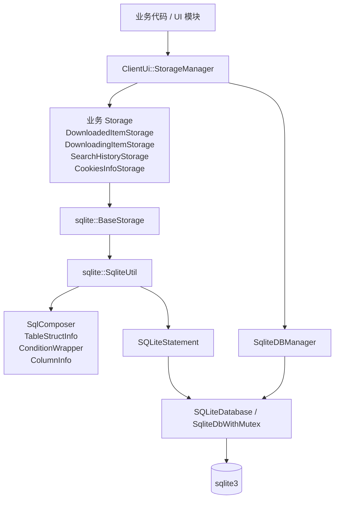

### 模块依赖图

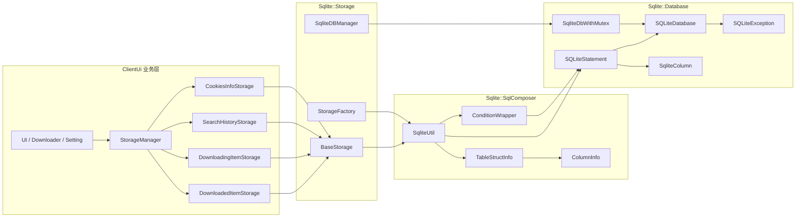

模块分为三层：

| 层级 | 主要文件 | 职责 |
| --- | --- | --- |
| Database | `Database/SQLiteDatabase.*`、`SQLiteStatement.*`、`SQLiteColumn.*`、`SQLiteException.*` | 封装 `sqlite3` 连接、预编译语句、列值读取、错误信息和事务 |
| SqlComposer | `SqlComposer/BaseInfo.*`、`ConditionWrapper.*`、`SqlUtil.*` | 根据实体元信息生成建表、插入、更新、查询、条件和索引 SQL |
| Storage | `Storage/BaseStorage.*`、`SqliteDBManager.*`、`StorageFactory.*` | 管理数据库连接，提供按业务表读写的统一入口 |

### 调用方向

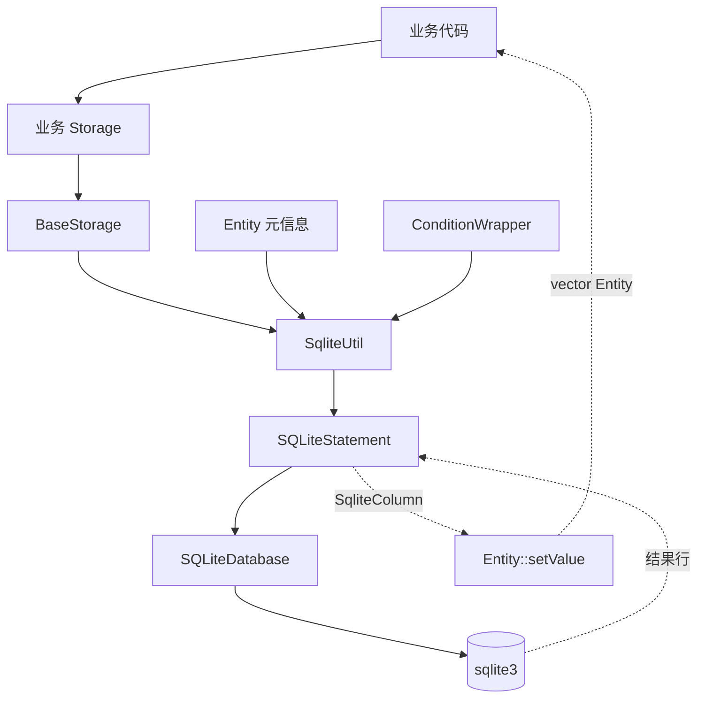

调用方向基本保持单向：业务层依赖 Storage，Storage 依赖 SQL 工具和数据库封装，底层不反向依赖业务。

## 目录结构

```text
sVanilla/src/Sqlite
|-- CMakeLists.txt
|-- SQLiteLog.h
|-- Database/
|   |-- SQLiteDatabase.h/.cpp      # 数据库连接、事务、错误信息
|   |-- SQLiteStatement.h/.cpp     # prepare/bind/step/reset
|   |-- SQLiteColumn.h/.cpp        # 查询结果列的类型和值
|   |-- SQLiteException.h/.cpp     # sqlite 错误异常
|-- SqlComposer/
|   |-- BaseInfo.h/.cpp            # 表结构元信息、字段元信息、宏注册
|   |-- ConditionWrapper.h/.cpp    # WHERE 条件构造与参数绑定
|   |-- SqlUtil.h/.cpp             # CRUD、建表、索引、视图等工具
|   |-- JoinWrapper.h              # join 信息结构，当前预留较轻
|-- Storage/
|   |-- BaseStorage.h/.cpp         # 业务 Storage 基类
|   |-- SqliteDBManager.h/.cpp     # 连接缓存、DB 初始化、WAL 配置
|   |-- StorageFactory.h/.cpp      # 泛型 Storage 创建辅助
```

## 类关系图

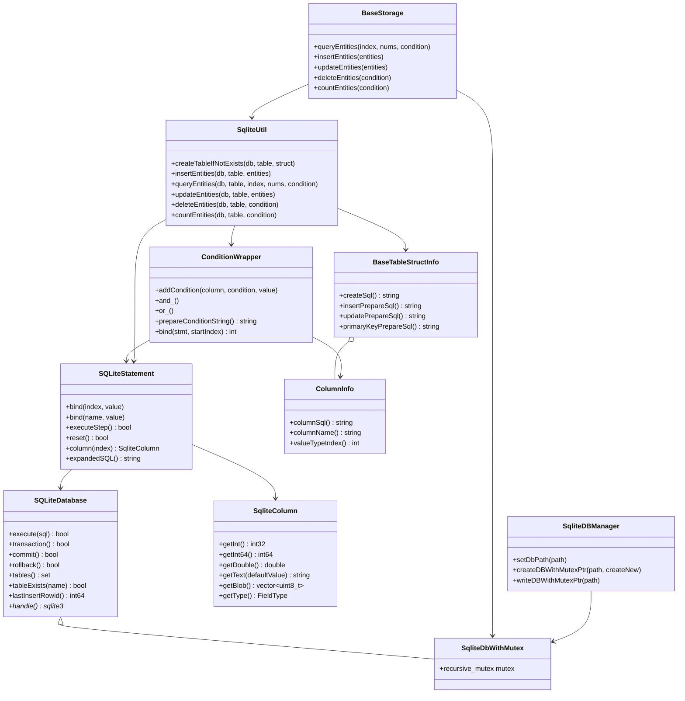

## 核心数据流

### 实体到表结构的映射

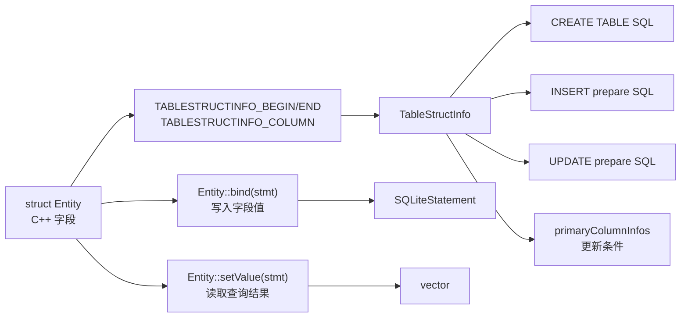

这套映射依赖显式声明，不依赖运行时反射。优点是编译期结构清晰、生成逻辑可控；代价是新增实体时需要手写 `bind()` 和 `setValue()`。

### 初始化和建表

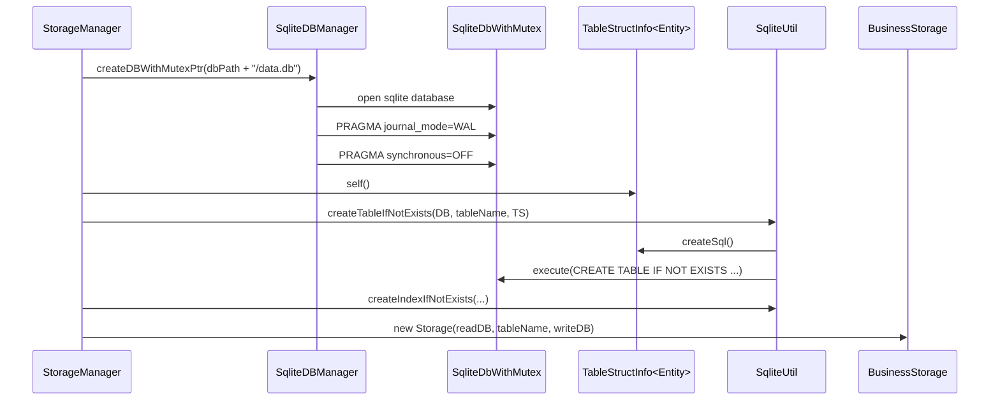

### 查询流程

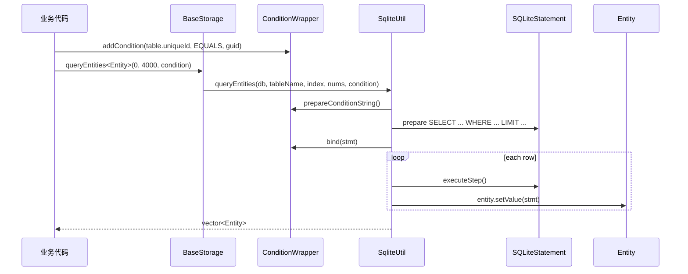

### 插入和更新流程

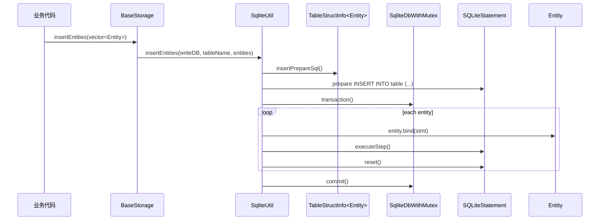

更新实体时，`SqliteUtil::updateEntities<Entity>` 会使用 `TableStructInfo<Entity>::primaryColumnInfos()` 生成 `WHERE` 条件，因此实体需要通过表结构宏声明主键字段。

## 二、重点分析：条件组装和拼 SQL

`ConditionWrapper` 是查询条件的核心封装。它负责两件事：

- 把业务条件组织成 `WHERE` 片段。
- 按占位符顺序把条件值绑定到 `SQLiteStatement`。

### 总览图

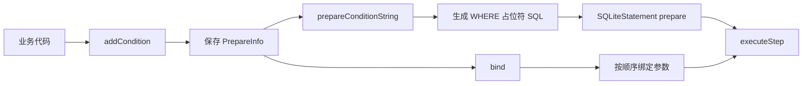

条件组装采用“SQL 结构”和“参数值”分离的方式：先生成 `WHERE column op ?` 这样的结构，再按顺序绑定具体值。

### 内部数据结构

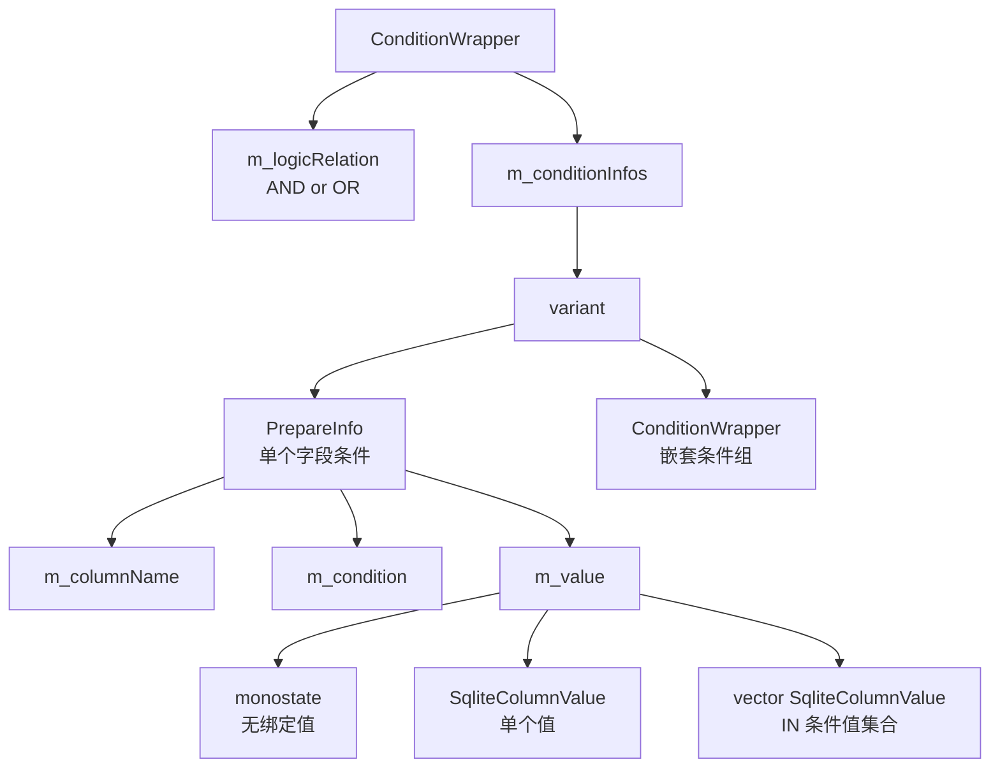

`m_conditionInfos` 使用 `std::variant<PrepareInfo, ConditionWrapper>`，因此一个条件组里既可以放普通条件，也可以放另一个条件组，用来表达嵌套逻辑。

### 条件类型到 SQL 操作符

| Condition | SQL 片段 |
| --- | --- |
| `EQUALS` | `column == ?` |
| `NOT_EQUALS` | `column <> ?` |
| `LE` | `column <= ?` |
| `GE` | `column >= ?` |
| `LT` | `column < ?` |
| `GT` | `column > ?` |
| `VALUES_IN` | `column IN (?, ?, ...)` |
| `VALUES_NOT_IN` | `column NOT IN (?, ?, ...)` |
| `LIKE` | `column LIKE ?` |
| `NOT_LIKE` | `column NOT LIKE ?` |
| `IS_NOT_NULL` | `column IS NOT ?` |
| `IS_NULL` | `column IS ?` |

当前实现里 `LIKE` 和 `NOT_LIKE` 会在 `addCondition()` 阶段给字符串值追加 `%`，也就是默认做“前缀匹配”：`abc` 会变成 `abc%`。

### 拼 SQL 的主流程

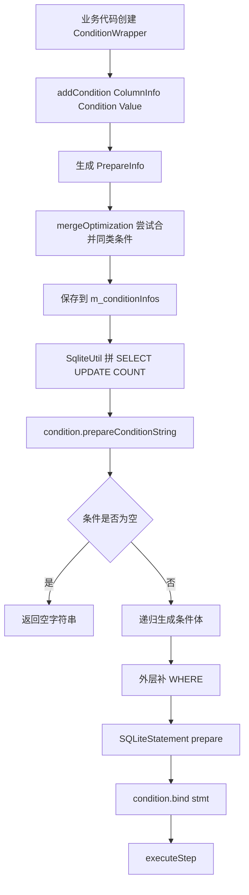

`ConditionWrapper::prepareConditionString()` 只生成占位符 SQL，不直接把值拼进去。例如：

```cpp
sqlite::ConditionWrapper condition;
condition.addCondition(table.uniqueId, sqlite::Condition::EQUALS, guid);
condition.addCondition(table.status, sqlite::Condition::GT, 0);
```

生成的条件 SQL 类似：

```sql
WHERE ( uniqueId  == ? AND  status  > ?)
```

随后 `ConditionWrapper::bind()` 会按照条件出现顺序绑定 `guid` 和 `0`。

### 单条件生成规则

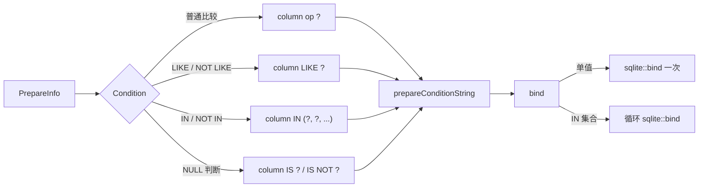

对应实现集中在 `PrepareInfo::prepareConditionString()` 和 `PrepareInfo::bind()`：

- `VALUES_IN` / `VALUES_NOT_IN` 根据集合大小生成多个 `?`。
- 其他条件生成单个 `?`。
- `bind()` 对 IN 集合逐个绑定，对普通条件绑定一个值。
- 如果 `m_value` 是 `monostate`，普通条件不会绑定值。

### 多条件和嵌套条件

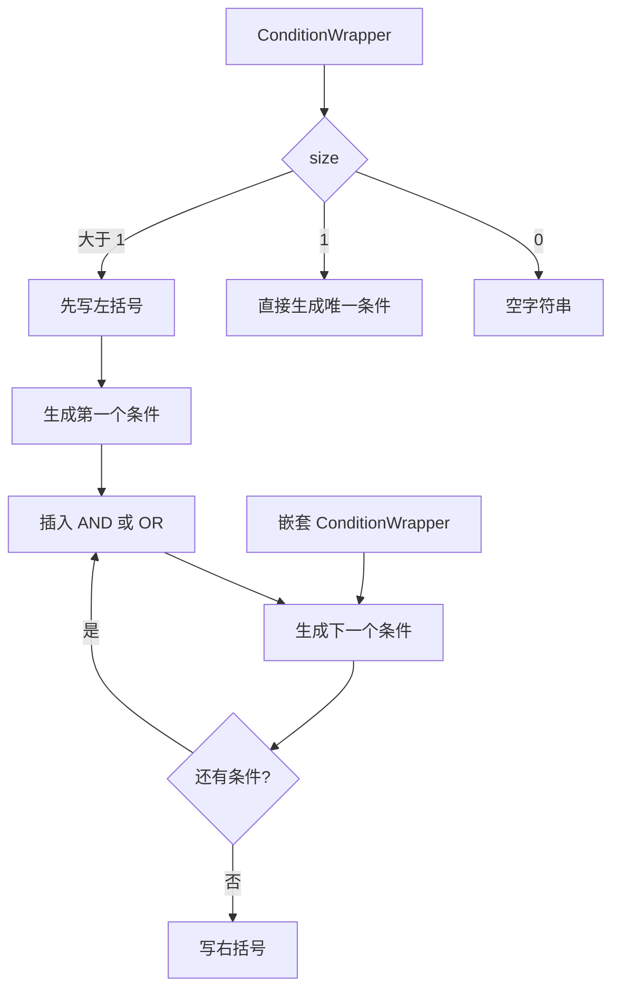

多条件会被括号包起来，避免和外层 SQL 或嵌套条件发生优先级歧义。`operator&` 会切换为 AND 组合，`operator|` 会切换为 OR 组合。

### 与 SqliteUtil 的组合方式

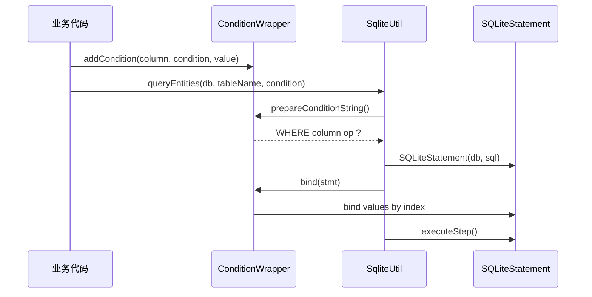

常见入口的拼接方式：

| 方法 | SQL 结构 | 条件处理 |
| --- | --- | --- |
| `queryEntities` | `SELECT * FROM table ... LIMIT ...` | 使用 `prepareConditionString()` + `bind()` |
| `updateEntities` 部分字段更新 | `UPDATE table SET col = ? ...` | 先绑定 SET 值，再绑定条件值 |
| `countEntities` | `SELECT COUNT(1) FROM table ...` | 使用 `prepareConditionString()` + `bind()` |
| `deleteEntities` | `DELETE FROM table ...` | 当前使用 `conditionString()` 直接拼值 |
| `createViewIfNotExist` | `CREATE VIEW ... AS SELECT ...` | 当前使用 `conditionString()` 直接拼值 |

需要注意：大多数查询和更新走参数绑定，但 `deleteEntities()` 和 `createViewIfNotExist()` 当前用的是 `conditionString()`，会把值直接拼进 SQL。业务输入如果来自用户，应优先改成 prepare + bind 的形式，或者保证上层输入已经受控。

### 条件合并优化

`ConditionWrapper::mergeOptimization()` 会在新增条件时尝试删除冗余条件。它主要处理同一字段上的同类比较：

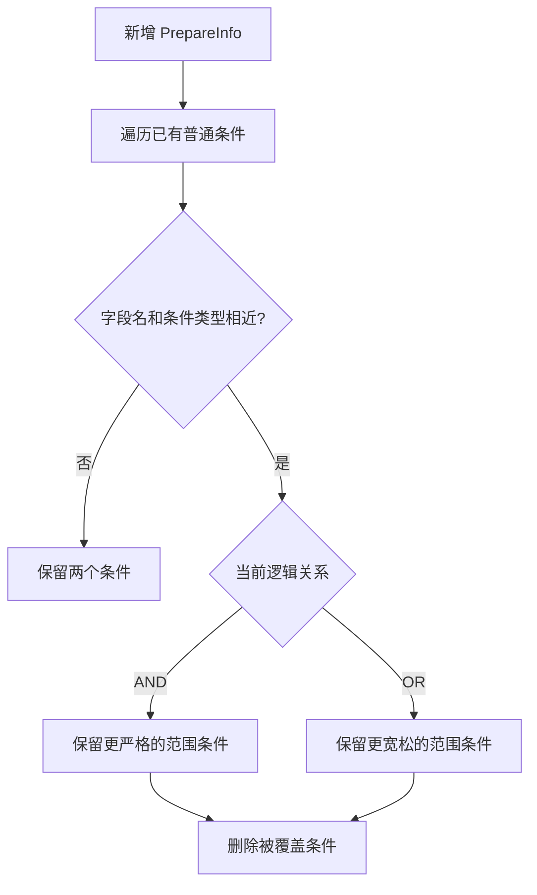

示例：

```cpp
condition.addCondition(table.progress, sqlite::Condition::GE, 10);
condition.addCondition(table.progress, sqlite::Condition::GE, 50);
```

在 AND 关系下，`progress >= 50` 已经覆盖 `progress >= 10`，因此可以删除较弱条件。

### 推荐用法

```cpp
auto& table = sqlite::TableStructInfo<DownloadingItem>::self();

sqlite::ConditionWrapper condition;
condition.addCondition(table.uniqueId, sqlite::Condition::EQUALS, guid);
condition.addCondition(table.status, sqlite::Condition::GE, DownloadStatus::Running);

auto items = storage->queryEntities<DownloadingItem>(0, 100, condition);
```

推荐规则：

- 查询、计数、更新优先使用 `prepareConditionString()` 和 `bind()` 的路径。
- 需要 OR 组合时，用单独的 `ConditionWrapper` 分组后再 `operator|`。
- `LIKE` 当前默认追加后缀 `%`，如果需要 `%keyword%` 这种包含匹配，需要传入前缀 `%`。
- `VALUES_IN` 的值集合不能为空，否则实现会记录 warning 并跳过生成有效条件。


### 线程和连接模型

```mermaid
flowchart TD
    Init[SqliteDBManager::init] --> Config[sqlite3_config<br/>SQLITE_CONFIG_MULTITHREAD]
    Init --> Dir[create dbPath directory]

    Request1[createDBWithMutexPtr(path)] --> Cache{path 是否已缓存}
    Request2[writeDBWithMutexPtr(path)] --> Cache
    Cache -->|否| Open[创建 SqliteDbWithMutex]
    Cache -->|是| Reuse[复用 cached db ptr]
    Open --> Pragma[PRAGMA journal_mode=WAL<br/>PRAGMA synchronous=OFF]
    Pragma --> Store[按绝对路径缓存]
    Reuse --> Lock[SqliteUtil 内部 lock_guard]
    Store --> Lock
    Lock --> ReadWrite[执行读写]
```

`SqliteDbWithMutex` 把互斥量和连接放在一起，`SqliteUtil` 在查询、插入、更新等入口统一加锁。这样业务代码不用直接处理 sqlite 连接的并发保护。

## 现有业务表

当前主业务数据库名为 `data.db`，由 `ClientUi/Storage/StorageManager` 初始化，默认包含以下表：

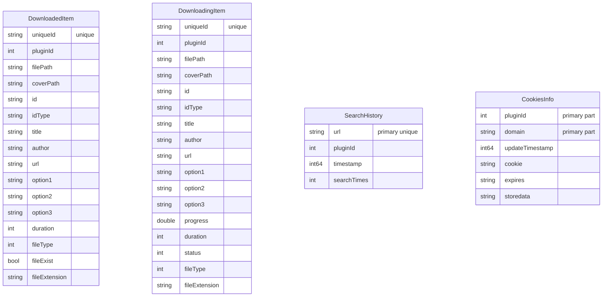

### 业务表与 Storage 对应关系

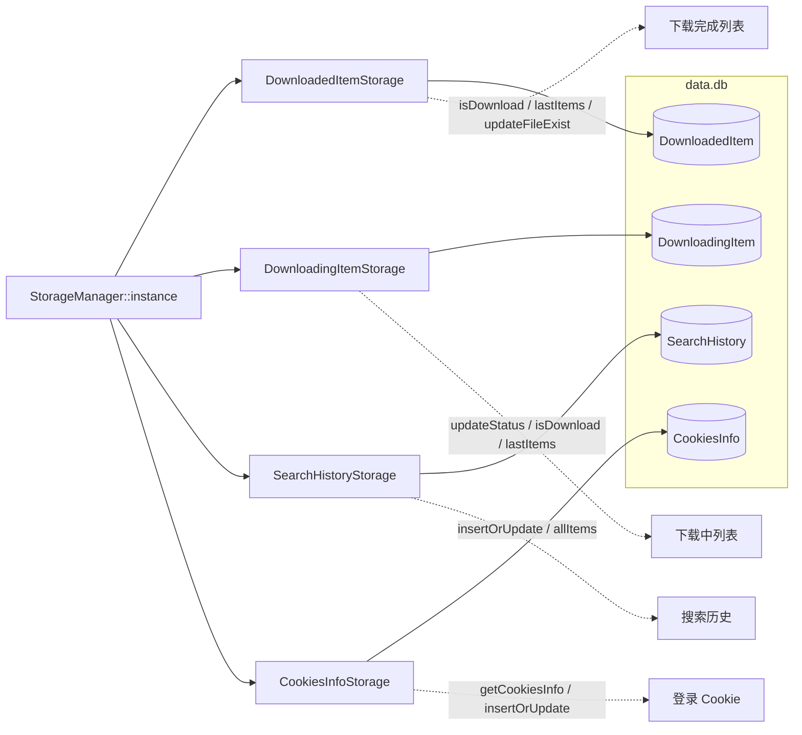

`StorageManager` 还会为部分高频查询创建索引：

| 表 | 索引字段 |
| --- | --- |
| `DownloadedItem` | `filePath`、`id` |
| `DownloadingItem` | `filePath`、`id` |
| `CookiesInfo` | `updateTimestamp`、`expires` |

`SearchHistory` 会创建触发器：

- 插入后限制历史数量，最多保留 `SearchHistoryStorage::maxNum` 条。
- 更新后增加 `searchTimes`。

## 设计优点

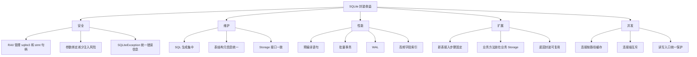

### 资源管理更安全

`SQLiteDatabase` 和 `SQLiteStatement` 使用 `unique_ptr` 加自定义 deleter 管理 `sqlite3*` 和 `sqlite3_stmt*`，避免调用方手动释放底层句柄。

### SQL 拼接集中化

建表、插入、更新和条件 SQL 主要由 `TableStructInfo`、`ColumnInfo`、`ConditionWrapper` 和 `SqliteUtil` 生成。业务代码不需要重复手写大量 `INSERT`、`UPDATE` 和 `WHERE` 字符串。

### 参数绑定减少注入风险

条件查询走 `prepareConditionString()` 生成占位符，再由 `ConditionWrapper::bind()` 绑定参数；实体插入和更新通过 `Entity::bind()` 绑定字段值。

### 读写接口统一

业务 Storage 继承 `BaseStorage` 后即可获得通用 CRUD 能力。业务类只需要补充领域相关方法，例如 `isDownload()`、`insertOrUpdate()`、`lastItems()`。

### 并发访问边界清晰

`SqliteDbWithMutex` 在数据库连接上挂载 `recursive_mutex`，`SqliteUtil` 在读写时统一加锁。`SqliteDBManager` 按路径缓存写连接，并在初始化时设置 SQLite multi-thread 模式和 WAL。

### 扩展新表成本低

新增表时主要完成三件事：

1. 定义实体结构体。
2. 实现 `bind()` 和 `setValue()`。
3. 使用 `TABLESTRUCTINFO_*` 宏注册字段。

之后就可以复用 `BaseStorage` 和 `SqliteUtil` 的通用逻辑。

### 业务语义更集中

每个业务表对应一个业务 Storage，通用 CRUD 留在 `BaseStorage`，领域逻辑放在具体 Storage。例如：

- `DownloadedItemStorage::isDownload()` 表达“是否已下载”。
- `DownloadingItemStorage::updateStatus()` 表达“更新下载状态”。
- `SearchHistoryStorage::insertOrUpdate()` 表达“搜索历史去重或更新”。
- `CookiesInfoStorage::getCookiesInfo()` 表达“按插件读取登录信息”。

这比在 UI 层散落 SQL 更容易维护，也更方便后续替换存储实现或调整表结构。

### 建表和字段变更更可追踪

字段定义集中在 `TABLESTRUCTINFO_COLUMN`，表结构 SQL 由 `TableStructInfo<Entity>::self().createSql()` 生成。开发者查看实体头文件即可知道：

- 字段名
- SQLite 字段类型
- 是否唯一
- 是否主键
- 是否自增

### 批量写入性能更好

`SqliteUtil::insertEntities()` 和 `SqliteUtil::updateEntities()` 在内部开启事务，循环复用同一个 `SQLiteStatement`。相比每条数据单独打开语句并提交事务，批量写入的 sqlite 开销更小。

### 调试路径清晰

`SQLiteStatement::expandedSQL()` 可查看绑定参数后的 SQL，适合定位条件生成、字段顺序、绑定值错误等问题。

## 设计取舍

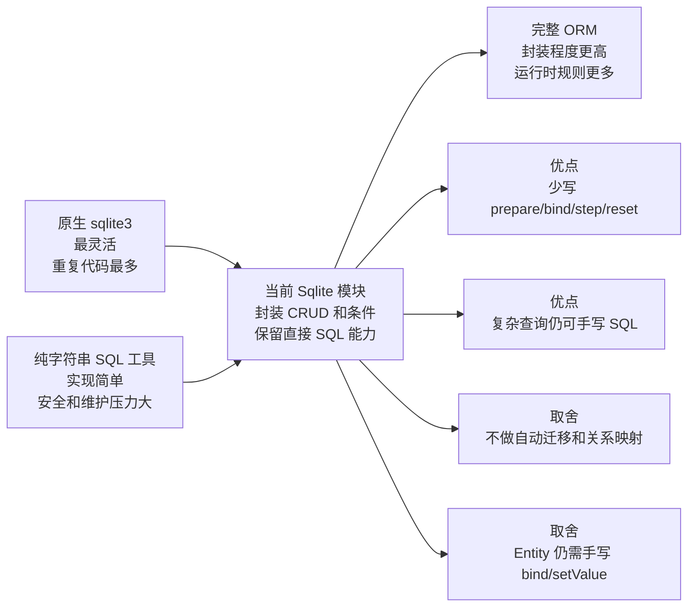

当前方案介于原生 sqlite3 和完整 ORM 之间：

- 比原生 sqlite3 少写大量重复 prepare、bind、step、reset 和事务代码。
- 比完整 ORM 更贴近 SQL，复杂查询仍可直接写 SQL。
- 不提供自动迁移、关系映射、懒加载等完整 ORM 能力。
- 字段映射靠显式宏和手写绑定，换来较低的运行时复杂度。

## 使用方式

### 1. 定义实体

实体字段应使用 `SqliteColumnValue` 支持的类型，例如整数、浮点数、`std::string`、`std::vector<uint8_t>`。

```cpp
struct SearchHistory
{
    std::string url;
    int pluginId;
    int64_t timestamp;
    int searchTimes{};

    int bind(sqlite::SQLiteStatement& stmt) const;
    void setValue(sqlite::SQLiteStatement& stmt, int startIndex = 0);
};
```

### 2. 实现绑定和读取

`bind()` 的顺序必须和 `TABLESTRUCTINFO_COLUMN` 声明顺序一致。

```cpp
int SearchHistory::bind(sqlite::SQLiteStatement& stmt) const
{
    int index = 1;
    stmt.bind(index++, url);
    stmt.bind(index++, pluginId);
    stmt.bind(index++, timestamp);
    stmt.bind(index++, searchTimes);
    return index;
}

void SearchHistory::setValue(sqlite::SQLiteStatement& stmt, int startIndex)
{
    url = stmt.column(startIndex++).getString();
    pluginId = stmt.column(startIndex++).getInt();
    timestamp = stmt.column(startIndex++).getInt64();
    searchTimes = stmt.column(startIndex++).getInt();
}
```

### 3. 注册表结构

```cpp
TABLESTRUCTINFO_BEGIN(SearchHistory)
    TABLESTRUCTINFO_COLUMN(url, url, false, true, true)
    TABLESTRUCTINFO_COLUMN(pluginId)
    TABLESTRUCTINFO_COLUMN(timestamp)
    TABLESTRUCTINFO_COLUMN(searchTimes)
TABLESTRUCTINFO_END(SearchHistory)
```

宏参数含义：

```text
TABLESTRUCTINFO_COLUMN(member)
TABLESTRUCTINFO_COLUMN(member, columnName)
TABLESTRUCTINFO_COLUMN(member, columnName, autoIncrement)
TABLESTRUCTINFO_COLUMN(member, columnName, autoIncrement, unique)
TABLESTRUCTINFO_COLUMN(member, columnName, autoIncrement, unique, primaryKey)
```

### 4. 创建业务 Storage

```cpp
class SearchHistoryStorage : public sqlite::BaseStorage
{
public:
    using Entity = SearchHistory;
    using BaseStorage::BaseStorage;

    bool insertOrUpdate(const std::string& url, int pluginId);
    std::vector<std::string> allItems();
};
```

创建表和 Storage：

```cpp
auto readPtr = sqlite::SqliteDBManager::createDBWithMutexPtr(sqlite::dbPath + "/data.db");
auto writePtr = sqlite::SqliteDBManager::createDBWithMutexPtr(sqlite::dbPath + "/data.db");

auto& tableStruct = sqlite::TableStructInfo<SearchHistoryStorage::Entity>::self();
sqlite::SqliteUtil::createTableIfNotExists(writePtr, "SearchHistory", tableStruct);

auto storage = std::make_shared<SearchHistoryStorage>(readPtr, "SearchHistory", writePtr);
```

也可以使用项目中的 `StorageManager` 统一获取现有业务 Storage：

```cpp
auto storage = sqlite::StorageManager::instance().searchHistoryStorage();
```

### 5. 查询

```cpp
auto& table = sqlite::TableStructInfo<SearchHistory>::self();

sqlite::ConditionWrapper condition;
condition.addCondition(table.url, sqlite::Condition::LIKE, std::string("%bilibili%"));

auto histories = storage->queryEntities<SearchHistory>(0, 20, condition);
```

### 6. 插入

```cpp
SearchHistory history;
history.url = "https://example.com/video";
history.pluginId = 1;
history.timestamp = 1710000000;
history.searchTimes = 1;

storage->insertEntities<SearchHistory>({history});
```

### 7. 更新

按实体更新时，`TableStructInfo` 中标记为主键或自增的字段会用于生成 `WHERE` 条件。

```cpp
history.searchTimes = 2;
storage->updateEntities<SearchHistory>({history});
```

更新部分字段时可以直接传 `SqliteColumn`：

```cpp
auto& table = sqlite::TableStructInfo<DownloadingItem>::self();

sqlite::ConditionWrapper condition;
condition.addCondition(table.uniqueId, sqlite::Condition::EQUALS, guid);

sqlite::SqliteColumnValue value = static_cast<int64_t>(status);
sqlite::SqliteColumn columnValue(value, -1, table.status.columnName());
sqlite::SqliteUtil::updateEntities(
    writeDb,
    "DownloadingItem",
    {columnValue},
    condition);
```

### 8. 删除和计数

```cpp
sqlite::ConditionWrapper condition;
condition.addCondition(table.url, sqlite::Condition::EQUALS, url);

storage->deleteEntities(condition);
auto count = storage->countEntities({});
```

## 接入新表建议

```mermaid
flowchart LR
    A[定义 Entity] --> B[实现 bind / setValue]
    B --> C[用 TABLESTRUCTINFO 注册字段]
    C --> D[继承 BaseStorage]
    D --> E[在 StorageManager 或工厂中创建表]
    E --> F[按业务需要创建索引 / 触发器]
    F --> G[业务代码调用 Storage]
```

### 是否应该新增 Storage

```mermaid
flowchart TD
    A[需要持久化一类业务数据] --> B{是否已有对应表?}
    B -->|是| C[在现有 Storage 增加业务方法]
    B -->|否| D{数据是否有明确实体结构?}
    D -->|是| E[新增 Entity + TableStructInfo + Storage]
    D -->|否| F{是否只是一次性统计/临时查询?}
    F -->|是| G[在相关 Storage 内写专用 SQL]
    F -->|否| H[先整理实体模型再建表]
    E --> I{是否有高频查询字段?}
    I -->|是| J[创建索引]
    I -->|否| K[保持默认表结构]
    J --> L[接入 StorageManager]
    K --> L
```

建议遵循：

- `bind()`、`setValue()`、`TABLESTRUCTINFO_COLUMN` 三者字段顺序保持一致。
- 高频查询字段在创建 Storage 时建立索引。
- 批量插入和批量更新优先使用 `SqliteUtil` 的事务封装接口。
- 条件查询优先使用 `ConditionWrapper`，减少手写 SQL。
- 复杂排序、聚合或 join 可以使用 `SqliteUtil::queryEntities<Entity>(db, querySql)`，但 SQL 字符串应集中在对应业务 Storage 内，不要散落在 UI 代码中。

## 注意事项

- 当前封装依赖实体自己实现 `bind()` 和 `setValue()`，不会自动反射字段值。
- `SqliteUtil::updateEntities<Entity>` 依赖主键字段生成更新条件，没有主键的实体不适合直接使用该接口。
- `SqliteDBManager` 初始化时设置 `PRAGMA synchronous=OFF`，性能更高，但异常断电场景下持久化保证较弱。
- `createDBWithMutexPtr(path, true)` 会创建一个新连接，同时缓存默认写连接；需要复用写连接时可使用 `writeDBWithMutexPtr(path)`。
- `ConditionWrapper::conditionString()` 会直接拼值，调试可以用；业务查询更推荐 `prepareConditionString()` 加 `bind()`。
